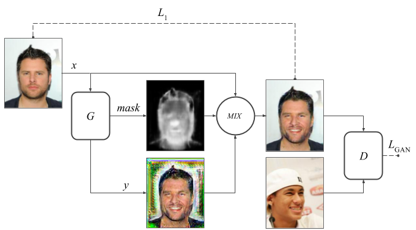
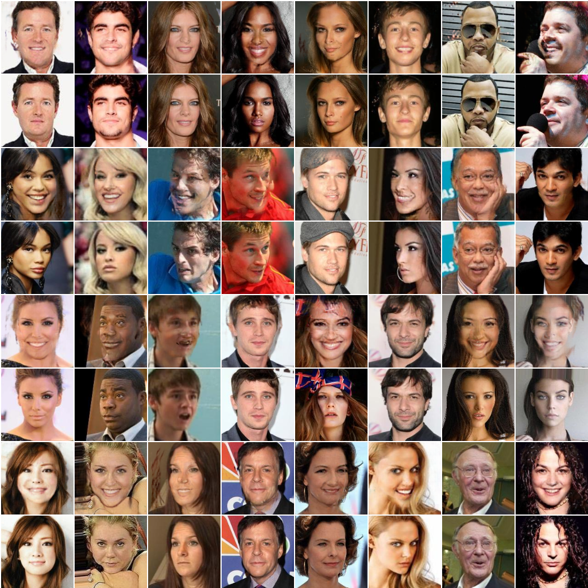

# Masking GAN - Generating image attribute mask (pytorch)

## !Disclaimer
This project is pretty much abandoned. I have achieved following results after spending a lot of time tuning the model. Unfortunatelly I was not able to reproduce results, which means I was lucky to get a good random seed once. Also, I am not interested in research in this direction right now, so the problem won't be fixed any time soon. C'est la vie.

## Motivation
When I first approached semantic manipulation problem there was no solution like CycleGAN, or later findings. And even now all of them produce artifacts.

## Approach


1. Use generator architecture with built-in segmentation.
2. Mix original image with new patches through the segmentation mask.
3. Train the whole network end-to-end.
4. Use L1 identity loss to constrain Generator and reduce changes.


## Instructions
I am using CelebA dataset to train the model. There are two files you would need to reproduce results: *img\_align\_celeba.zip* and *list\_attr\_celeba.txt*

You can download them from here http://mmlab.ie.cuhk.edu.hk/projects/CelebA.html and put into {PROJECT\_DIR}/data  
After that initialize data and train the model by running
```bash
sh init_data.sh
python train.py
```

## Results

1. In case a person is already smiling it doesn’t do any changes at all.
2. It handles poorly some extreme head angles.
3. There are still artifacts.

## Advices
Consider following advices if you want to build this kind of a model:
1. Make sure your GAN model converges without appling mask and L1 loss.

## Acknowledgments
The code is inspired by [pytorch-CycleGAN-and-pix2pix](https://github.com/junyanz/pytorch-CycleGAN-and-pix2pix) . 
This paper [GANimation: Anatomically-aware Facial Animation from a Single Image arXiv:1807.09251](https://arxiv.org/abs/1807.09251) describes similar training scheme.
